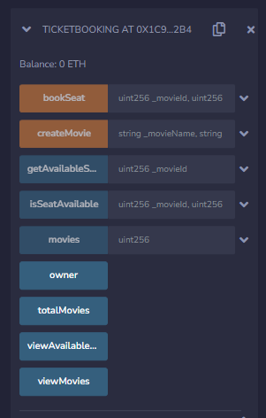

# Movie Ticket Booking System - Web3 #

## Technologies Used ##

**Front-end**
- NextJs
- Tailwind CSS
- Thirdweb React SDK

**Back-end**
- Solidty
- Hardhat

**Blockchain**
- Polygon - Mumbai
- Metamask Wallet
- Thirdweb platform

## Features ##
**Functions of the smart contract**
- Creating a movie
- Retrieving movie details
- Booking a seat
- Retrieving available seats
- Checking seat availability
- Counting the total number of movies
- Viewing details about every movie
- Viewing details about available movies

## Features ##
- This include cryptocurrency wallet integration - Metamask
- There are 2 main user interfaces including 
  > User
  > Admin

## How to run ##

**To deploy the Smart contract to Thirdweb platform**
`cd back-end`
`yarn deploy`

**To run the application**
`cd front-end`
`yarn run`
